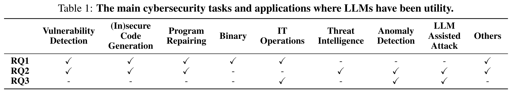
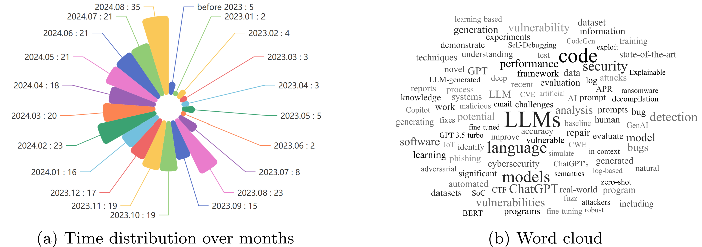

## <div align="center">When LLMs Meet Cybersecurity: A Systematic Literature Review<div> 

<div align="center">
<a href="https://arxiv.org/abs/2405.03644"></a> &ensp;
</div>

## 🔥 Updates
📆[2025-03-03] We have updated the related papers up to **Feb 28th**, with *33* new papers added (2025.01.01-2025.02.28).

📆[2025-01-21] We have updated the related papers up to **Dec 31st**, with *74* new papers added (2024.09.01-2024.12.31).

📆[2025-01-08] We have included **the publication venues** for each paper.

📆[2024-09-21] We have updated the related papers up to **Aug 31st**, with *75* new papers added (2024.06.01-2024.08.31).

<!-- TOC -->

- [When LLMs Meet Cybersecurity: A Systematic Literature Review](#when-llms-meet-cybersecurity-a-systematic-literature-review)
- [🔥 Updates](#-updates)
- [🌈 Introduction](#-introduction)
- [🚩 Features](#-features)
- [🌟 Literatures](#-literatures)
  - [RQ1: How to construct cybersecurity-oriented domain LLMs?](#rq1-how-to-construct-cybersecurity-oriented-domain-llms)
    - [Cybersecurity Evaluation Benchmarks](#cybersecurity-evaluation-benchmarks)
    - [Fine-tuned Domain LLMs for Cybersecurity](#fine-tuned-domain-llms-for-cybersecurity)
  - [RQ2: What are the potential applications of LLMs in cybersecurity?](#rq2-what-are-the-potential-applications-of-llms-in-cybersecurity)
    - [Threat Intelligence](#threat-intelligence)
    - [FUZZ](#fuzz)
    - [Vulnerabilities Detection](#vulnerabilities-detection)
    - [Insecure code Generation](#insecure-code-generation)
    - [Program Repair](#program-repair)
    - [Anomaly Detection](#anomaly-detection)
    - [LLM Assisted Attack](#llm-assisted-attack)
    - [Others](#others)
  - [RQ3: What are further research directions about the application of LLMs in cybersecurity?](#rq3-what-are-further-research-directions-about-the-application-of-llms-in-cybersecurity)
    - [Further Research: Agent4Cybersecurity](#further-research-agent4cybersecurity)
- [📖BibTeX](#bibtex)

<!-- /TOC -->
## 🌈 Introduction
We are excited to present "When LLMs Meet Cybersecurity: A Systematic Literature Review," a comprehensive overview of LLM applications in cybersecurity.

We seek to address three key questions: 
- RQ1: How to construct cyber security-oriented domain LLMs?
- RQ2: What are the potential applications of LLMs in cybersecurity?
- RQ3: What are the existing challenges and further research directions about the application of LLMs in cybersecurity?




## 🚩 Features

(2024.08.20) Our study encompasses an analysis of over 300 works, spanning across 25+ LLMs and more than 10 downstream scenarios.




## 🌟 Literatures

### RQ1: How to construct cybersecurity-oriented domain LLMs?

#### Cybersecurity Evaluation Benchmarks

1. Primus: A Pioneering Collection of Open-Source Datasets for Cybersecurity LLM Training | *arXiv* | 2025.02.16 | [<u>Paper Link</u>](https://arxiv.org/pdf/2502.11191)

2. ITBench: Evaluating AI Agents across Diverse Real-World IT Automation Tasks | *arXiv* | 2025.02.07 | [<u>Paper Link</u>](https://arxiv.org/pdf/2502.05352)

3. SecBench: A Comprehensive Multi-Dimensional Benchmarking Dataset for LLMs in Cybersecurity | *arXiv* | 2024.12.31 | [<u>Paper Link</u>](https://arxiv.org/pdf/2412.20787)

4. AI Cyber Risk Benchmark: Automated Exploitation Capabilities | *arXiv* | 2024.12.09 | [<u>Paper Link</u>](https://arxiv.org/pdf/2410.21939)

5. CS-Eval: A Comprehensive Large Language Model Benchmark for CyberSecurity | *arXiv* | 2024.11.25 | [<u>Paper Link</u>](https://arxiv.org/pdf/2411.16239)

6. AttackER: Towards Enhancing Cyber-Attack Attribution with a Named Entity Recognition Dataset | *arXiv* | 2024.08.09 | [<u>Paper Link</u>](https://arxiv.org/pdf/2408.05149)

7. CYBERSECEVAL 3: Advancing the Evaluation of Cybersecurity Risks and Capabilities in Large Language Models | *arXiv* | 2024.08.03 | [<u>Paper Link</u>](https://arxiv.org/pdf/2408.01605)

8. eyeballvul: a future-proof benchmark for vulnerability detection in the wild | *arXiv* | 2024.07.11 | [<u>Paper Link</u>](https://arxiv.org/pdf/2407.08708)

9. NYU CTF Dataset: A Scalable Open-Source Benchmark Dataset for Evaluating LLMs in Offensive Security | *arXiv* | 2024.06.09 | [<u>Paper Link</u>](https://arxiv.org/pdf/2406.05590)

10. SECURE: Benchmarking Generative Large Language Models for Cybersecurity Advisory | *arXiv* | 2024.05.30 | [<u>Paper Link</u>](https://arxiv.org/pdf/2405.20441)

11. Assessing Cybersecurity Vulnerabilities in Code Large Language Models | *arXiv* | 2024.04.29 | [<u>Paper Link</u>](https://arxiv.org/pdf/2404.18567)

12. Can LLMs Understand Computer Networks? Towards a Virtual System Administrator | *arXiv* | 2024.04.22 | [<u>Paper Link</u>](https://arxiv.org/pdf/2404.12689)

13. LLMSecEval: A Dataset of Natural Language Prompts for Security Evaluations | *IEEE/ACM International Conference on Mining Software Repositories* | 2023.03.16 | [<u>Paper Link</u>](https://arxiv.org/abs/2303.09384)

14. OpsEval: A Comprehensive IT Operations Benchmark Suite for Large Language Models | *arXiv* | 2024.02.16 | [<u>Paper Link</u>](https://arxiv.org/abs/2310.07637)

15. Can llms patch security issues? | *arXiv* | 2024.02.19 | [<u>Paper Link</u>](https://arxiv.org/abs/2312.00024)

16. CyberMetric: A Benchmark Dataset for Evaluating Large Language Models Knowledge in Cybersecurity | *arXiv* | 2024.02.12 | [<u>Paper Link</u>](https://arxiv.org/abs/2402.07688)

17. DebugBench: Evaluating Debugging Capability of Large Language Models | *ACL Findings* | 2024.01.11 | [<u>Paper Link</u>](https://arxiv.org/abs/2401.04621)

18. Securityeval dataset: mining vulnerability examples to evaluate machine learning-based code generation techniques. | *Proceedings of the 1st International Workshop on Mining Software Repositories Applications for Privacy and Security* | 2022.11.09 | [<u>Paper Link</u>](https://dl.acm.org/doi/10.1145/3549035.3561184)

19. SecQA: A Concise Question-Answering Dataset for Evaluating Large Language Models in Computer Security | *arXiv* | 2023.12.26 | [<u>Paper Link</u>](https://arxiv.org/abs/2312.15838v1)

20. Purple Llama CyberSecEval: A Secure Coding Benchmark for Language Models | *arXiv* | 2023.12.07 | [<u>Paper Link</u>](https://arxiv.org/abs/2312.04724)

21. An empirical study of netops capability of pre-trained large language models. | *arXiv* | 2023.09.19 | [<u>Paper Link</u>](https://arxiv.org/abs/2309.05557)

22. SecEval: A Comprehensive Benchmark for Evaluating Cybersecurity Knowledge of Foundation Models | *Github* | 2023 | [<u>Paper Link</u>](https://xuanwuai.github.io/SecEval/)
    

#### Fine-tuned Domain LLMs for Cybersecurity

1. Fine-tuning Large Language Models for DGA and DNS Exfiltration Detection | *arXiv* | 2024.11.07 | [<u>Paper Link</u>](https://arxiv.org/pdf/2410.21723)

2. AttackQA: Development and Adoption of a Dataset for Assisting Cybersecurity Operations using Fine-tuned and Open-Source LLMs | *arXiv* | 2024.11.02 | [<u>Paper Link</u>](https://arxiv.org/pdf/2411.01073)

3. Hackphyr: A Local Fine-Tuned LLM Agent for Network Security Environments | *arXiv* | 2024.09.17 | [<u>Paper Link</u>](https://arxiv.org/pdf/2409.11276)

4. CyberPal.AI: Empowering LLMs with Expert-Driven Cybersecurity Instructions | *arXiv* | 2024.08.18 | [<u>Paper Link</u>](https://arxiv.org/pdf/2408.09304)

5. IoT-LM: Large Multisensory Language Models for the Internet of Things | *arXiv* | 2024.07.13 | [<u>Paper Link</u>](https://arxiv.org/pdf/2407.09801)

6. A Comprehensive Evaluation of Parameter-Efficient Fine-Tuning on Automated Program Repair | *arXiv* | 2024.06.09 | [<u>Paper Link</u>](https://arxiv.org/pdf/2406.05639)

7. Security Vulnerability Detection with Multitask Self-Instructed Fine-Tuning of Large Language Models | *arXiv* | 2024.06.09 | [<u>Paper Link</u>](https://arxiv.org/pdf/2406.05892)

8. Transforming Computer Security and Public Trust Through the Exploration of Fine-Tuning Large Language Models | *arXiv* | 2024.06.02 | [<u>Paper Link</u>](https://arxiv.org/pdf/2406.00628)

9. Assessing LLMs in Malicious Code Deobfuscation of Real-world Malware Campaigns | *arXiv* | 2024.04.30 | [<u>Paper Link</u>](https://arxiv.org/pdf/2404.19715)

10. Nova+: Generative Language Models for Binaries | *arXiv* | 2023.11.27 | [<u>Paper Link</u>](https://arxiv.org/abs/2311.13721)

11. Instruction Tuning for Secure Code Generation | *ICML* | 2024.02.14 | [<u>Paper Link</u>](https://arxiv.org/abs/2402.09497)

12. Efficient Avoidance of Vulnerabilities in Auto-completed Smart Contract Code Using Vulnerability-constrained Decoding | *ISSRE* | 2023.10.06 | [<u>Paper Link</u>](https://arxiv.org/abs/2309.09826)

13. RepairLLaMA: Efficient Representations and Fine-Tuned Adapters for Program Repair | *arXiv* | 2024.03.11 | [<u>Paper Link</u>](https://arxiv.org/abs/2312.15698)

14. Finetuning Large Language Models for Vulnerability Detection | *arXiv* | 2024.02.29 | [<u>Paper Link</u>](https://arxiv.org/abs/2401.17010)

15. Large Language Models for Test-Free Fault Localization | *ICSE* | 2023.10.03 | [<u>Paper Link</u>](https://arxiv.org/abs/2310.01726)

16. HackMentor: Fine-tuning Large Language Models for Cybersecurity | *TrustCom* | 2023.09 | [<u>Paper Link</u>](https://github.com/tmylla/HackMentor)

17. Owl: A Large Language Model for IT Operations | *ICLR* | 2023.09.17 | [<u>Paper Link</u>](https://arxiv.org/abs/2309.09298)

18. SecureFalcon: The Next Cyber Reasoning System for Cyber Security | *arXiv* | 2023.07.13 | [<u>Paper Link</u>](https://arxiv.org/abs/2307.06616)


### RQ2: What are the potential applications of LLMs in cybersecurity?

#### Threat Intelligence

1. Labeling NIDS Rules with MITRE ATT&CK Techniques: Machine Learning vs. Large Language Models | *arXiv* | 2024.12.16 | [<u>Paper Link</u>](https://arxiv.org/pdf/2412.10978)

2. IntellBot: Retrieval Augmented LLM Chatbot for Cyber Threat Knowledge Delivery | *arXiv* | 2024.11.08| [<u>Paper Link</u>](https://arxiv.org/pdf/2411.05442)

3. CTINEXUS: Leveraging Optimized LLM In-Context Learning for Constructing Cybersecurity Knowledge Graphs Under Data Scarcity | *arXiv* | 2024.10.28 | [<u>Paper Link</u>](https://arxiv.org/pdf/2410.21060)

4. AI-Driven Cyber Threat Intelligence Automation | *arXiv* | 2024.10.27 | [<u>Paper Link</u>](https://arxiv.org/pdf/2410.20287)

5. Cyber Knowledge Completion Using Large Language Models | *arXiv* | 2024.09.24 | [<u>Paper Link</u>](https://arxiv.org/pdf/2409.16176)

6. Evaluating the Usability of LLMs in Threat Intelligence Enrichment | *arXiv* | 2024.09.23 | [<u>Paper Link</u>](https://arxiv.org/pdf/2409.15072)

7. KGV: Integrating Large Language Models with Knowledge Graphs for Cyber Threat Intelligence Credibility Assessment | *arXiv* | 2024.08.15 | [<u>Paper Link</u>](https://arxiv.org/pdf/2408.08088)

8. Usefulness of data flow diagrams and large language models for security threat validation: a registered report | *arXiv* | 2024.08.14 | [<u>Paper Link</u>](https://arxiv.org/pdf/2408.07537)

9. A RAG-Based Question-Answering Solution for Cyber-Attack Investigation and Attribution | *arXiv* | 2024.08.12 | [<u>Paper Link</u>](https://arxiv.org/pdf/2408.06272)

10. The Use of Large Language Models (LLM) for Cyber Threat Intelligence (CTI) in Cybercrime Forums | *arXiv* | 2024.08.08 | [<u>Paper Link</u>](https://arxiv.org/pdf/2408.03354)

11. Psychological Profiling in Cybersecurity: A Look at LLMs and Psycholinguistic Features | *arXiv* | 2024.08.09 | [<u>Paper Link</u>](https://arxiv.org/pdf/2406.18783)

12. Using LLMs to Automate Threat Intelligence Analysis Workflows in Security Operation Centers | *arXiv* | 2024.07.18 | [<u>Paper Link</u>](https://arxiv.org/pdf/2407.13093)

13. LLMCloudHunter: Harnessing LLMs for Automated Extraction of Detection Rules from Cloud-Based CTI | *arXiv* | 2024.07.06 | [<u>Paper Link</u>](https://arxiv.org/pdf/2407.05194)

14. Actionable Cyber Threat Intelligence using Knowledge Graphs and Large Language Models | *arXiv* | 2024.06.30 | [<u>Paper Link</u>](https://arxiv.org/pdf/2407.02528)

15. AttacKG+:Boosting Attack Knowledge Graph Construction with Large Language Models | *EuroS&P Workshop* | 2024.05.08 | [<u>Paper Link</u>](https://arxiv.org/pdf/2405.04753)

16. SEvenLLM: Benchmarking, Eliciting, and Enhancing Abilities of Large Language Models in Cyber Threat Intelligence | *arXiv* | 2024.05.06 | [<u>Paper Link</u>](https://arxiv.org/pdf/2405.03446)

17. Crimson: Empowering Strategic Reasoning in Cybersecurity through Large Language Models | *arXiv* | 2024.03.01 | [<u>Paper Link</u>](https://arxiv.org/abs/2403.00878)

18. Evaluation of LLM Chatbots for OSINT-based Cyber Threat Awareness | *Expert Syst. Appl.* | 2024.03.13 | [<u>Paper Link</u>](https://arxiv.org/abs/2401.15127)

19. LOCALINTEL: Generating Organizational Threat Intelligence from Global and Local Cyber Knowledge | *arXiv* | 2024.01.18 | [<u>Paper Link</u>](https://arxiv.org/abs/2401.10036)

20. Advancing TTP Analysis: Harnessing the Power of Encoder-Only and Decoder-Only Language Models with Retrieval Augmented Generation | *arXiv* | 2024.01.12 | [<u>Paper Link</u>](https://arxiv.org/abs/2401.00280)

21. ChatGPT, Llama, can you write my report? An experiment on assisted digital forensics reports written using (Local) Large Language Models | *Forensic Sci. Int. Digit. Investig.* | 2023.12.22 | [<u>Paper Link</u>](https://arxiv.org/abs/2312.14607)

22. HW-V2W-Map: Hardware Vulnerability to Weakness Mapping Framework for Root Cause Analysis with GPT-assisted Mitigation Suggestion | *arXiv* | 2023.12.21 | [<u>Paper Link</u>](https://arxiv.org/abs/2312.13530)

23. AGIR: Automating Cyber Threat Intelligence Reporting with Natural Language Generation | *BigData* | 2023.10.04 | [<u>Paper Link</u>](https://ieeexplore.ieee.org/abstract/document/10386116)

24. Cyber Sentinel: Exploring Conversational Agents in Streamlining Security Tasks with GPT-4 | *arXiv* | 2023.09.28 | [<u>Paper Link</u>](https://arxiv.org/abs/2309.16422)

25. Cupid: Leveraging ChatGPT for More Accurate Duplicate Bug Report Detection | *arXiv* | 2023.08.27 | [<u>Paper Link</u>](https://arxiv.org/abs/2308.10022)

26. On the Uses of Large Language Models to Interpret Ambiguous Cyberattack Descriptions | *arXiv* | 2023.08.22 | [<u>Paper Link</u>](https://arxiv.org/abs/2306.14062)

27. An Empirical Study on Using Large Language Models to Analyze Software Supply Chain Security Failures | *Proceedings of the 2023 Workshop on Software Supply Chain Offensive Research and Ecosystem Defenses* | 2023.08.09 | [<u>Paper Link</u>](https://arxiv.org/abs/2308.04898)

28. Time for aCTIon: Automated Analysis of Cyber Threat Intelligence in the Wild | *arXiv* | 2023.07.14 | [<u>Paper Link</u>](https://arxiv.org/abs/2307.10214)


#### FUZZ

1. Your Fix Is My Exploit: Enabling Comprehensive DL Library API Fuzzing with Large Language Models | *arXiv* | 2025.01.08 | [<u>Paper Link</u>](https://arxiv.org/pdf/2501.04312)

2. Large Language Model assisted Hybrid Fuzzing | *arXiv* | 2024.12.19 | [<u>Paper Link</u>](https://arxiv.org/pdf/2412.15931)

3. Harnessing Large Language Models for Seed Generation in Greybox Fuzzing | *arXiv* | 2024.11.27 | [<u>Paper Link</u>](https://arxiv.org/pdf/2411.18143)

4. ChatHTTPFuzz: Large Language Model-Assisted IoT HTTP Fuzzing | *arXiv* | 2024.11.18 | [<u>Paper Link</u>](https://arxiv.org/pdf/2411.11929)

5. AutoSafeCoder: A Multi-Agent Framework for Securing LLM Code Generation through Static Analysis and Fuzz Testing | *arXiv* | 2024.11.05 | [<u>Paper Link</u>](https://arxiv.org/pdf/2409.10737)

6. FuzzCoder: Byte-level Fuzzing Test via Large Language Model | *arXiv* | 2024.09.03 | [<u>Paper Link</u>](https://arxiv.org/pdf/2409.01944)

7. An Exploratory Study on Using Large Language Models for Mutation Testing | *arXiv* | 2024.06.14 | [<u>Paper Link</u>](https://arxiv.org/pdf/2406.09843)

8. When Fuzzing Meets LLMs: Challenges and Opportunities | *ACM International Conference on the Foundations of Software Engineering* | 2024.04.25 | [<u>Paper Link</u>](https://arxiv.org/pdf/2404.16297)

9. Fuzzing BusyBox: Leveraging LLM and Crash Reuse for Embedded Bug Unearthing | *USENIX* | 2024.03.06 | [<u>Paper Link</u>](https://arxiv.org/abs/2403.03897)

10. Large language model guided protocol fuzzing | *NDSS* | 2024.02.26 | [<u>Paper Link</u>](https://www.ndss-symposium.org/wp-content/uploads/2024-556-paper.pdf?ref=blog.exploits.club)

11. Fuzz4All: Universal Fuzzing with Large Language Models | *ICSE* | 2024.01.15 | [<u>Paper Link</u>](https://arxiv.org/abs/2308.04748)

12. How well does LLM generate security tests? | *arXiv* | 2023.10.03 | [<u>Paper Link</u>](https://arxiv.org/abs/2310.00710)

13. CODAMOSA: Escaping Coverage Plateaus in Test Generation with Pre-trained Large Language Models | *ICSE* | 2023.07.26 | [<u>Paper Link</u>](https://ieeexplore.ieee.org/document/10172800/)

14. Understanding Large Language Model Based Fuzz Driver Generation | *arXiv* | 2023.07.24 | [<u>Paper Link</u>](https://arxiv.org/abs/2307.12469)

15. Large Language Models Are Zero-Shot Fuzzers: Fuzzing Deep-Learning Libraries via Large Language Models | *ISSTA* | 2023.06.07 | [<u>Paper Link</u>](https://arxiv.org/abs/2212.14834)

16. Augmenting Greybox Fuzzing with Generative AI | *arXiv* | 2023.06.11 | [<u>Paper Link</u>](https://arxiv.org/abs/2306.06782)

17. Large Language Models are Edge-Case Fuzzers: Testing Deep Learning Libraries via FuzzGPT | *arXiv* | 2023.04.04 | [<u>Paper Link</u>](https://arxiv.org/abs/2304.02014)


#### Vulnerabilities Detection

1. CVE-LLM : Ontology-Assisted Automatic Vulnerability Evaluation Using Large Language Models | *arXiv* | 2025.02.21 | [<u>Paper Link</u>](https://arxiv.org/pdf/2502.15932)

2. Large Language Models in Software Security: A Survey of Vulnerability Detection Techniques and Insights | *arXiv* | 2025.02.10 | [<u>Paper Link</u>](https://arxiv.org/pdf/2502.07049)

3. Large Language Models for In-File Vulnerability Localization Can Be "Lost in the End" | *arXiv* | 2025.02.09 | [<u>Paper Link</u>](https://arxiv.org/pdf/2502.06898)

4. Streamlining Security Vulnerability Triage with Large Language Models | *arXiv* | 2025.01.31 | [<u>Paper Link</u>](https://arxiv.org/pdf/2501.18908)

5. Evaluating Large Language Models in Vulnerability Detection Under Variable Context Windows | *arXiv* | 2025.01.30 | [<u>Paper Link</u>](https://arxiv.org/pdf/2502.00064)

6. Helping LLMs Improve Code Generation Using Feedback from Testing and Static Analysis | *arXiv* | 2025.01.07 | [<u>Paper Link</u>](https://arxiv.org/pdf/2412.14841)

7. CGP-Tuning: Structure-Aware Soft Prompt Tuning for Code Vulnerability Detection | *arXiv* | 2025.01.08 | [<u>Paper Link</u>](https://arxiv.org/pdf/2501.04510)

8. Leveraging Large Language Models and Machine Learning for Smart Contract Vulnerability Detection | *arXiv* | 2025.01.04 | [<u>Paper Link</u>](https://arxiv.org/pdf/2501.02229)

9. Investigating Large Language Models for Code Vulnerability Detection: An Experimental Study | *arXiv* | 2024.12.24 | [<u>Paper Link</u>](https://arxiv.org/pdf/2412.18260)

10. Can LLM Prompting Serve as a Proxy for Static Analysis in Vulnerability Detection | *arXiv* | 2024.12.16 | [<u>Paper Link</u>](https://arxiv.org/pdf/2412.12039)

11. ChatNVD: Advancing Cybersecurity Vulnerability Assessment with Large Language Models | *arXiv* | 2024.12.06 | [<u>Paper Link</u>](https://arxiv.org/pdf/2412.04756)

12. CleanVul: Automatic Function-Level Vulnerability Detection in Code Commits Using LLM Heuristics | *arXiv* | 2024.11.26 | [<u>Paper Link</u>](https://arxiv.org/pdf/2411.17274)

13. EnStack: An Ensemble Stacking Framework of Large Language Models for Enhanced Vulnerability Detection in Source Code | *arXiv* | 2024.11.25 | [<u>Paper Link</u>](https://arxiv.org/pdf/2411.16561)

14. CryptoFormalEval: Integrating LLMs and Formal Verification for Automated Cryptographic Protocol Vulnerability Detection | *arXiv* | 2024.11.20 | [<u>Paper Link</u>](https://arxiv.org/pdf/2411.13627)

15. Beyond Static Tools: Evaluating Large Language Models for Cryptographic Misuse Detection | *arXiv* | 2024.11.14 | [<u>Paper Link</u>](https://arxiv.org/pdf/2411.09772)

16. LProtector: An LLM-driven Vulnerability Detection System | *arXiv* | 2024.11.04 | [<u>Paper Link</u>](https://arxiv.org/pdf/2411.06493)

17. Enhancing Reverse Engineering: Investigating and Benchmarking Large Language Models for Vulnerability Analysis in Decompiled Binaries | *arXiv* | 2024.11.07 | [<u>Paper Link</u>](https://arxiv.org/pdf/2411.04981)

18. ProveRAG: Provenance-Driven Vulnerability Analysis with Automated Retrieval-Augmented LLMs | *arXiv* | 2024.10.22 | [<u>Paper Link</u>](https://arxiv.org/pdf/2410.17406)

19. RealVul: Can We Detect Vulnerabilities in Web Applications with LLM? | *arXiv* | 2024.10.10 | [<u>Paper Link</u>](https://arxiv.org/pdf/2410.07573)

20. Code Vulnerability Repair with Large Language Model using Context-Aware Prompt Tuning | *arXiv* | 2024.09.27 | [<u>Paper Link</u>](https://arxiv.org/pdf/2409.18395)

21. Boosting Cybersecurity Vulnerability Scanning based on LLM-supported Static Application Security Testing | *arXiv* | 2024.09.24 | [<u>Paper Link</u>](https://arxiv.org/pdf/2409.15735)

22. VulnLLMEval: A Framework for Evaluating Large Language Models in Software Vulnerability Detection and Patching | *arXiv* | 2024.09.17 | [<u>Paper Link</u>](https://arxiv.org/pdf/2409.10756)

23. Code Vulnerability Detection: A Comparative Analysis of Emerging Large Language Models | *arXiv* | 2024.09.16 | [<u>Paper Link</u>](https://arxiv.org/pdf/2409.10490)

24. Exploring LLMs for Malware Detection: Review, Framework Design, and Countermeasure Approaches | *arXiv* | 2024.09.11 | [<u>Paper Link</u>](https://arxiv.org/pdf/2409.07587)

25. SAFE: Advancing Large Language Models in Leveraging Semantic and Syntactic Relationships for Software Vulnerability Detection | *arXiv* | 2024.09.02 | [<u>Paper Link</u>](https://arxiv.org/pdf/2409.00882)

26. Outside the Comfort Zone: Analysing LLM Capabilities in Software Vulnerability Detection | *European symposium on research in computer security* | 2024.08.29 | [<u>Paper Link</u>](https://arxiv.org/pdf/2408.16400)

27. ANVIL: Anomaly-based Vulnerability Identification without Labelled Training Data | *arXiv* | 2024.08.28 | [<u>Paper Link</u>](https://arxiv.org/pdf/2408.16028)

28. LLM-Enhanced Static Analysis for Precise Identification of Vulnerable OSS Versions | *arXiv* | 2024.08.14 | [<u>Paper Link</u>](https://arxiv.org/pdf/2408.07321)

29. Exploring RAG-based Vulnerability Augmentation with LLMs | *arXiv* | 2024.08.08 | [<u>Paper Link</u>](https://arxiv.org/pdf/2408.04125)

30. Harnessing the Power of LLMs in Source Code Vulnerability Detection | *arXiv* | 2024.08.07 | [<u>Paper Link</u>](https://arxiv.org/pdf/2408.03489)

31. Towards Effectively Detecting and Explaining Vulnerabilities Using Large Language Models | *arXiv* | 2024.08.08 | [<u>Paper Link</u>](https://arxiv.org/pdf/2406.09701)

32. Comparison of Static Application Security Testing Tools and Large Language Models for Repo-level Vulnerability Detection | *arXiv* | 2024.07.23 | [<u>Paper Link</u>](https://arxiv.org/pdf/2407.16235)

33. SCoPE: Evaluating LLMs for Software Vulnerability Detection | *arXiv* | 2024.07.19 | [<u>Paper Link</u>](https://arxiv.org/pdf/2407.14372)

34. Static Detection of Filesystem Vulnerabilities in Android Systems | *arXiv* | 2024.07.16 | [<u>Paper Link</u>](https://arxiv.org/pdf/2407.11279)

35. Detect Llama -- Finding Vulnerabilities in Smart Contracts using Large Language Models | *Information Security and Privacy* | 2024.07.12 | [<u>Paper Link</u>](https://arxiv.org/pdf/2407.08969)

36. Assessing the Effectiveness of LLMs in Android Application Vulnerability Analysis | *arXiv* | 2024.06.27 | [<u>Paper Link</u>](https://arxiv.org/pdf/2406.18894)

37. MALSIGHT: Exploring Malicious Source Code and Benign Pseudocode for Iterative Binary Malware Summarization | *arXiv* | 2024.06.26 | [<u>Paper Link</u>](https://arxiv.org/pdf/2406.18379)

38. Vul-RAG: Enhancing LLM-based Vulnerability Detection via Knowledge-level RAG | *arXiv* | 2024.06.19 | [<u>Paper Link</u>](https://arxiv.org/pdf/2406.11147)

39. Generalization-Enhanced Code Vulnerability Detection via Multi-Task Instruction Fine-Tuning | *ACL Findings* | 2024.06.06 | [<u>Paper Link</u>](https://arxiv.org/pdf/2406.03718)

40. LLM-Assisted Static Analysis for Detecting Security Vulnerabilities | *arXiv* | 2024.05.27 | [<u>Paper Link</u>](https://arxiv.org/pdf/2405.17238)

41. Harnessing Large Language Models for Software Vulnerability Detection: A Comprehensive Benchmarking Study | *arXiv* | 2024.05.24 | [<u>Paper Link</u>](https://arxiv.org/pdf/2405.15614)

42. DLAP: A Deep Learning Augmented Large Language Model Prompting Framework for Software Vulnerability Detection | *Journal of Systems and Software* | 2024.05.02 | [<u>Paper Link</u>](https://arxiv.org/pdf/2405.01202)

43. Large Language Model for Vulnerability Detection and Repair: Literature Review and Roadmap | *arXiv* | 2024.04.04 | [<u>Paper Link</u>](https://arxiv.org/pdf/2404.02525)

44. How Far Have We Gone in Vulnerability Detection Using Large Language Models | *arXiv* | 2023.12.22 | [<u>Paper Link</u>](https://arxiv.org/abs/2311.12420)

45. The FormAI Dataset: Generative AI in Software Security through the Lens of Formal Verification | *International Conference on Predictive Models and Data Analytics in Software Engineering* | 2023.09.02 | [<u>Paper Link</u>](https://arxiv.org/abs/2307.02192)

46. DiverseVul: A New Vulnerable Source Code Dataset for Deep Learning Based Vulnerability Detection | *International Symposium on Research in Attacks, Intrusions and Defenses* | 2023.08.09 | [<u>Paper Link</u>](https://arxiv.org/abs/2304.00409)

47. How ChatGPT is Solving Vulnerability Management Problem | *arXiv* | 2023.11.11 | [<u>Paper Link</u>](https://arxiv.org/abs/2311.06530)

48. Multi-role Consensus through LLMs Discussions for Vulnerability Detection | *arXiv* | 2024.03.21 | [<u>Paper Link</u>](https://arxiv.org/abs/2403.14274)

49. LLM4Vuln: A Unified Evaluation Framework for Decoupling and Enhancing LLMs' Vulnerability Reasoning | *arXiv* | 2024.01.29 | [<u>Paper Link</u>](https://arxiv.org/abs/2401.16185)

50. LLbezpeky: Leveraging Large Language Models for Vulnerability Detection | *arXiv* | 2024.01.13 | [<u>Paper Link</u>](https://arxiv.org/abs/2401.01269)

51. Software Vulnerability Detection with GPT and In-Context Learning | *DSC* | 2024.01.08 | [<u>Paper Link</u>](https://ieeexplore.ieee.org/abstract/document/10381286)

52. GPTScan: Detecting Logic Vulnerabilities in Smart Contracts by Combining GPT with Program Analysis | *ICSE* | 2023.12.25 | [<u>Paper Link</u>](https://arxiv.org/abs/2308.03314)

53. Understanding the Effectiveness of Large Language Models in Detecting Security Vulnerabilities | *arXiv* | 2023.11.16 | [<u>Paper Link</u>](https://arxiv.org/abs/2311.16169)

54. The Hitchhiker's Guide to Program Analysis: A Journey with Large Language Models | *arXiv* | 2023.11.15 | [<u>Paper Link</u>](https://arxiv.org/abs/2308.00245)

55. Large Language Model-Powered Smart Contract Vulnerability Detection: New Perspectives | *TPS-ISA* | 2023.10.16 | [<u>Paper Link</u>](https://arxiv.org/abs/2310.01152)

56. Large Language Models for Test-Free Fault Localization | *ICSE* | 2023.10.03 | [<u>Paper Link</u>](https://arxiv.org/abs/2310.01726)

57. DefectHunter: A Novel LLM-Driven Boosted-Conformer-based Code Vulnerability Detection Mechanism | *arXiv* | 2023.09.27 | [<u>Paper Link</u>](https://arxiv.org/abs/2309.15324)

58. Software Vulnerability Detection using Large Language Models | *ISSRE Workshop* | 2023.09.02 | [<u>Paper Link</u>](https://ieeexplore.ieee.org/document/10301302/)

59. Using ChatGPT as a Static Application Security Testing Tool | *arXiv* | 2023.08.28 | [<u>Paper Link</u>](https://arxiv.org/abs/2308.14434)

60. Prompt-Enhanced Software Vulnerability Detection Using ChatGPT | *ICSE* | 2023.08.24 | [<u>Paper Link</u>](https://arxiv.org/abs/2308.12697)

61. VulLibGen: Identifying Vulnerable Third-Party Libraries via Generative Pre-Trained Model | *arXiv* | 2023.08.09 | [<u>Paper Link</u>](https://arxiv.org/abs/2308.04662)

62. Evaluation of ChatGPT Model for Vulnerability Detection | *arXiv* | 2023.04.12 | [<u>Paper Link</u>](https://arxiv.org/abs/2304.07232)

63. Software Vulnerability and Functionality Assessment using LLMs | *arXiv* | 2024.03.13 | [<u>Paper Link</u>](https://arxiv.org/abs/2403.08429)

64. Finetuning Large Language Models for Vulnerability Detection | *arXiv* | 2024.03.01 | [<u>Paper Link</u>](https://arxiv.org/abs/2401.17010)

65. Detecting software vulnerabilities using Language Models | *CSR* | 2023.02.23 | [<u>Paper Link</u>](https://arxiv.org/abs/2302.11773)

    


#### Insecure code Generation

1. Benchmarking Prompt Engineering Techniques for Secure Code Generation with GPT Models | *arXiv* | 2025.02.09 | [<u>Paper Link</u>](https://arxiv.org/pdf/2502.06039)

2. ContractTinker: LLM-Empowered Vulnerability Repair for Real-World Smart Contracts | *arXiv* | 2024.09.15 | [<u>Paper Link</u>](https://arxiv.org/pdf/2409.09661)

3. An Exploratory Study on Fine-Tuning Large Language Models for Secure Code Generation | *arXiv* | 2024.08.17 | [<u>Paper Link</u>](https://arxiv.org/pdf/2408.09078)

4. Is Your AI-Generated Code Really Safe? Evaluating Large Language Models on Secure Code Generation with CodeSecEval | *arXiv* | 2024.07.04 | [<u>Paper Link</u>](https://arxiv.org/pdf/2407.02395)

5. DistiLRR: Transferring Code Repair for Low-Resource Programming Languages | *arXiv* | 2024.06.20 | [<u>Paper Link</u>](https://arxiv.org/pdf/2406.14867)

6. Code Repair with LLMs gives an Exploration-Exploitation Tradeoff | *arXiv* | 2024.05.30 | [<u>Paper Link</u>](https://arxiv.org/pdf/2405.17503)

7. LLM Security Guard for Code | *International Conference on Evaluation and Assessment in Software Engineering* | 2024.05.03 | [<u>Paper Link</u>](https://arxiv.org/pdf/2405.01103)

8. Do Neutral Prompts Produce Insecure Code? FormAI-v2 Dataset: Labelling Vulnerabilities in Code Generated by Large Language Models | *arXiv* | 2024.04.29 | [<u>Paper Link</u>](https://arxiv.org/pdf/2404.18353)

9. Evolutionary Large Language Models for Hardware Security: A Comparative Survey | *arXiv* | 2024.04.25 | [<u>Paper Link</u>](https://arxiv.org/abs/2404.16651)

10. FLAG: Finding Line Anomalies (in code) with Generative AI | *arXiv* | 2023.07.22 | [<u>Paper Link</u>](https://arxiv.org/abs/2306.12643)

11. Make LLM a Testing Expert: Bringing Human-like Interaction to Mobile GUI Testing via Functionality-aware Decisions | *ICSE* | 2023.10.24 | [<u>Paper Link</u>](https://arxiv.org/abs/2310.15780)

12. DebugBench: Evaluating Debugging Capability of Large Language Models | *ACL Findings* | 2024.01.11 | [<u>Paper Link</u>](https://arxiv.org/abs/2401.04621)

13. Shifting the Lens: Detecting Malware in npm Ecosystem with Large Language Models | *arXiv* | 2024.03.18 | [<u>Paper Link</u>](https://arxiv.org/abs/2403.12196)

14. Using ChatGPT to Analyze Ransomware Messages and to Predict Ransomware Threats | *Research Square* | 2023.11.21 | [<u>Paper Link</u>](https://assets.researchsquare.com/files/rs-3645967/v1_covered_a2d4c021-581c-44a3-ba60-058002d65bf9.pdf)

15. Prompt Engineering-assisted Malware Dynamic Analysis Using GPT-4 | *arXiv* | 2023.12.13 | [<u>Paper Link</u>](https://arxiv.org/abs/2312.08317)

16. Evaluating and Explaining Large Language Models for Code Using Syntactic Structures | *arXiv* | 2023.08.07 | [<u>Paper Link</u>](https://arxiv.org/abs/2308.03873)

17. Understanding Programs by Exploiting (Fuzzing) Test Cases | *ACL Findings* | 2023.01.12 | [<u>Paper Link</u>](https://arxiv.org/abs/2305.13592)

18. Large Language Models for Code Analysis: Do LLMs Really Do Their Job? | *USENIX* | 2024.03.05 | [<u>Paper Link</u>](https://arxiv.org/abs/2310.12357)

19. LLM4Decompile: Decompiling Binary Code with Large Language Models | *EMNLP* | 2024.03.08 | [<u>Paper Link</u>](https://arxiv.org/abs/2403.05286)

20. Pop Quiz! Can a Large Language Model Help With Reverse Engineering? | *arXiv* | 2022.02.02 | [<u>Paper Link</u>](https://arxiv.org/abs/2202.01142)

21. Large Language Models for Code: Security Hardening and Adversarial Testing | *ACM SIGSAC Conference on Computer and Communications Security* | 2023.09.29 | [<u>Paper Link</u>](https://arxiv.org/abs/2302.05319)

22. How Secure is Code Generated by ChatGPT? | *SMC* | 2023.04.19 | [<u>Paper Link</u>](https://arxiv.org/abs/2304.09655)

23. A Comparative Study of Code Generation using ChatGPT 3.5 across 10 Programming Languages | *arXiv* | 2023.08.08 | [<u>Paper Link</u>](https://arxiv.org/abs/2308.04477)

24. Can Large Language Models Identify And Reason About Security Vulnerabilities? Not Yet | *arXiv* | 2023.12.19 | [<u>Paper Link</u>](https://arxiv.org/abs/2312.12575)

25. Is your code generated by chatgpt really correct? rigorous evaluation of large language models for code generation | *NeurIPS* | 2023.10.30 | [<u>Paper Link</u>](https://arxiv.org/abs/2305.01210)

26. Generate and Pray: Using SALLMS to Evaluate the Security of LLM Generated Code | *arXiv* | 2023.11.01 | [<u>Paper Link</u>](https://arxiv.org/abs/2311.00889)

27. No Need to Lift a Finger Anymore? Assessing the Quality of Code Generation by ChatGPT | *IEEE Trans. Software Eng.* | 2023.08.09 | [<u>Paper Link</u>](https://arxiv.org/abs/2308.04838)

28. The Effectiveness of Large Language Models (ChatGPT and CodeBERT) for Security-Oriented Code Analysis | *arXiv* | 2023.08.29 | [<u>Paper Link</u>](https://arxiv.org/abs/2307.12488)

29. Asleep at the Keyboard? Assessing the Security of GitHub Copilot’s Code Contributions | *S&P* | 2021.12.16 | [<u>Paper Link</u>](https://arxiv.org/abs/2108.09293)

30. Bugs in Large Language Models Generated Code | *arXiv* | 2024.03.18 | [<u>Paper Link</u>](https://arxiv.org/abs/2403.08937)

31. Lost at C: A User Study on the Security Implications of Large Language Model Code Assistants | *USENIX* | 2023.02.27 | [<u>Paper Link</u>](https://arxiv.org/abs/2208.09727)


#### Program Repair

1. LLM4CVE: Enabling Iterative Automated Vulnerability Repair with Large Language Models | *arXiv* | 2025.01.07 | [<u>Paper Link</u>](https://arxiv.org/pdf/2501.03446)

2. From Defects to Demands: A Unified, Iterative, and Heuristically Guided LLM-Based Framework for Automated Software Repair and Requirement Realization | *arXiv* | 2024.12.06 | [<u>Paper Link</u>](https://arxiv.org/pdf/2412.05098)

3. Integrating Various Software Artifacts for Better LLM-based Bug Localization and Program Repair | *arXiv* | 2024.12.05 | [<u>Paper Link</u>](https://arxiv.org/pdf/2412.03905)

4. Fixing Security Vulnerabilities with AI in OSS-Fuzz | *arXiv* | 2024.11.21 | [<u>Paper Link</u>](https://arxiv.org/pdf/2411.03346)

5. A Comprehensive Survey of AI-Driven Advancements and Techniques in Automated Program Repair and Code Generation | *arXiv* | 2024.11.12 | [<u>Paper Link</u>](https://arxiv.org/pdf/2411.07586)

6. The Best Defense is a Good Offense: Countering LLM-Powered Cyberattacks | *arXiv* | 2024.10.20 | [<u>Paper Link</u>](https://arxiv.org/pdf/2410.15396)

7. APOLLO: A GPT-based tool to detect phishing emails and generate explanations that warn users | *arXiv* | 2024.10.10 | [<u>Paper Link</u>](https://arxiv.org/pdf/2410.07997)

8. Fixing Code Generation Errors for Large Language Models | *arXiv* | 2024.09.01 | [<u>Paper Link</u>](https://arxiv.org/pdf/2409.00676)

9. MergeRepair: An Exploratory Study on Merging Task-Specific Adapters in Code LLMs for Automated Program Repair | *arXiv* | 2024.08.26 | [<u>Paper Link</u>](https://arxiv.org/pdf/2408.09568)

10. Automated Software Vulnerability Patching using Large Language Models | *arXiv* | 2024.08.24 | [<u>Paper Link</u>](https://arxiv.org/pdf/2408.13597)

11. Enhancing LLM-Based Automated Program Repair with Design Rationales | *ASE* | 2024.08.22 | [<u>Paper Link</u>](https://arxiv.org/pdf/2408.12056)

12. RePair: Automated Program Repair with Process-based Feedback | *ACL Findings* | 2024.08.21 | [<u>Paper Link</u>](https://arxiv.org/pdf/2408.11296)

13. Revisiting Evolutionary Program Repair via Code Language Model | *arXiv* | 2024.08.20 | [<u>Paper Link</u>](https://arxiv.org/pdf/2408.10486)

14. ThinkRepair: Self-Directed Automated Program Repair | *ACM SIGSOFT International Symposium on Software Testing and Analysis* | 2024.07.30 | [<u>Paper Link</u>](https://arxiv.org/pdf/2407.20898)

15. Automated C/C++ Program Repair for High-Level Synthesis via Large Language Models | *ACM/IEEE International Symposium on Machine Learning for CAD* | 2024.07.04 | [<u>Paper Link</u>](https://arxiv.org/pdf/2407.03889)

16. Hybrid Automated Program Repair by Combining Large Language Models and Program Analysis | *arXiv* | 2024.06.04 | [<u>Paper Link</u>](https://arxiv.org/pdf/2406.00992)

17. A Case Study of LLM for Automated Vulnerability Repair: Assessing Impact of Reasoning and Patch Validation Feedback | *Proceedings of the 1st ACM International Conference on AI-Powered Software* | 2024.05.24 | [<u>Paper Link</u>](https://arxiv.org/pdf/2405.15690)

18. Automated Repair of AI Code with Large Language Models and Formal Verification | *arXiv* | 2024.05.14 | [<u>Paper Link</u>](https://arxiv.org/pdf/2405.08848)

19. A Systematic Literature Review on Large Language Models for Automated Program Repair | *arXiv* | 2024.05.12 | [<u>Paper Link</u>](https://arxiv.org/pdf/2405.01466)

20. Revisiting Unnaturalness for Automated Program Repair in the Era of Large Language Models | *arXiv* | 2024.03.23 | [<u>Paper Link</u>](https://arxiv.org/pdf/2404.15236)

21. How Far Can We Go with Practical Function-Level Program Repair? | *arXiv* | 2024.04.19 | [<u>Paper Link</u>](https://arxiv.org/pdf/2404.12833)

22. Multi-Objective Fine-Tuning for Enhanced Program Repair with LLMs | *arXiv* | 2024.04.22 | [<u>Paper Link</u>](https://arxiv.org/pdf/2404.12636)

23. Aligning LLMs for FL-free Program Repair | *arXiv* | 2024.04.13 | [<u>Paper Link</u>](https://arxiv.org/pdf/2404.08877)

24. When Large Language Models Confront Repository-Level Automatic Program Repair: How Well They Done? | *ICSE* | 2023.03.01 | [<u>Paper Link</u>](https://arxiv.org/abs/2403.00448)

25. ContrastRepair: Enhancing Conversation-Based Automated Program Repair via Contrastive Test Case Pairs | *arXiv* | 2024.03.07 | [<u>Paper Link</u>](https://arxiv.org/abs/2403.01971)

26. LLM-Powered Code Vulnerability Repair with Reinforcement Learning and Semantic Reward | *arXiv* | 2024.02.22 | [<u>Paper Link</u>](https://arxiv.org/abs/2401.03374)

27. Copiloting the Copilots: Fusing Large Language Models with Completion Engines for Automated Program Repair | *ACM Joint European Software Engineering Conference and Symposium on the Foundations of Software Engineering* | 2023.11.08 | [<u>Paper Link</u>](https://arxiv.org/abs/2309.00608)

28. Better Patching Using LLM Prompting, via Self-Consistency | *ASE* | 2023.08.16 | [<u>Paper Link</u>](https://arxiv.org/abs/2306.00108)

29. Teaching Large Language Models to Self-Debug | *ICLR* | 2023.10.05 | [<u>Paper Link</u>](https://arxiv.org/abs/2304.05128)

30. Enhanced Automated Code Vulnerability Repair using Large Language Models | *Eng. Appl. Artif. Intell.* | 2024.01.08 | [<u>Paper Link</u>](https://arxiv.org/abs/2401.03741)

31. A Study of Vulnerability Repair in JavaScript Programs with Large Language Models | *WWW* | 2023.03.19 | [<u>Paper Link</u>](https://arxiv.org/abs/2403.13193)

32. Fixing Hardware Security Bugs with Large Language Models | *arXiv* | 2023.02.02 | [<u>Paper Link</u>](https://arxiv.org/abs/2302.01215)

33. DIVAS: An LLM-based End-to-End Framework for SoC Security Analysis and Policy-based Protection | *arXiv* | 2023.08.14 | [<u>Paper Link</u>](https://arxiv.org/abs/2308.06932)

34. ZeroLeak: Using LLMs for Scalable and Cost Effective Side-Channel Patching | *arXiv* | 2023.08.24 | [<u>Paper Link</u>](https://arxiv.org/abs/2308.13062)

35. InferFix: End-to-End Program Repair with LLMs | *ESEC/FSE* | 2023.03.13 | [<u>Paper Link</u>](https://arxiv.org/abs/2303.07263)

36. Can LLMs Patch Security Issues? | *arXiv* | 2024.02.19 | [<u>Paper Link</u>](https://arxiv.org/abs/2312.00024)

37. How Effective Are Neural Networks for Fixing Security Vulnerabilities | *ISSTA* | 2023.05.29 | [<u>Paper Link</u>](https://arxiv.org/abs/2305.18607)

38. Examining Zero-Shot Vulnerability Repair with Large Language Models | *SP* | 2022.08.15 | [<u>Paper Link</u>](https://arxiv.org/abs/2112.02125)

39. Security Code Review by LLMs: A Deep Dive into Responses  | *arXiv* | 2024.01.29 | [<u>Paper Link</u>](https://arxiv.org/abs/2401.16310)

40. Practical Program Repair in the Era of Large Pre-trained Language Models | *arXiv* | 2022.10.25 | [<u>Paper Link</u>](https://arxiv.org/abs/2210.14179)

41. AI-powered patching: the future of automated vulnerability fixes | *google* | 2024.01.31 | [<u>Paper Link</u>](https://research.google/pubs/ai-powered-patching-the-future-of-automated-vulnerability-fixes/)

42. An Analysis of the Automatic Bug Fixing Performance of ChatGPT | *APR@ICSE* | 2023.01.20 | [<u>Paper Link</u>](https://arxiv.org/abs/2301.08653)

43. Automatic Program Repair with OpenAI's Codex: Evaluating QuixBugs | *arXiv* | 2023.11.06 | [<u>Paper Link</u>](https://arxiv.org/abs/2111.03922)


#### Anomaly Detection

1. Cyber Defense Reinvented: Large Language Models as Threat Intelligence Copilots | *arXiv* | 2025.02.28 | [<u>Paper Link</u>](https://arxiv.org/pdf/2502.20791)

2. Design and implementation of a distributed security threat detection system integrating federated learning and multimodal LLM | *arXiv* | 2025.02.28 | [<u>Paper Link</u>](https://arxiv.org/pdf/2502.17763)

3. LAMD: Context-driven Android Malware Detection and Classification with LLMs | *arXiv* | 2025.02.18 | [<u>Paper Link</u>](https://arxiv.org/pdf/2502.13055)

4. APT-LLM: Embedding-Based Anomaly Detection of Cyber Advanced Persistent Threats Using Large Language Models | *arXiv* | 2025.02.13 | [<u>Paper Link</u>](https://arxiv.org/pdf/2502.09385)

5. AdaPhish: AI-Powered Adaptive Defense and Education Resource Against Deceptive Emails | *arXiv* | 2025.02.05 | [<u>Paper Link</u>](https://arxiv.org/pdf/2502.03622)

6. SHIELD: APT Detection and Intelligent Explanation Using LLM | *arXiv* | 2025.02.04 | [<u>Paper Link</u>](https://arxiv.org/pdf/2502.02342)

7. LLM-based event log analysis techniques: A survey | *arXiv* | 2025.02.02 | [<u>Paper Link</u>](https://arxiv.org/pdf/2502.00677)

8. TORCHLIGHT: Shedding LIGHT on Real-World Attacks on Cloudless IoT Devices Concealed within the Tor Network | *arXiv* | 2025.01.28 | [<u>Paper Link</u>](https://arxiv.org/pdf/2501.16784)

9. Confront Insider Threat: Precise Anomaly Detection in Behavior Logs Based on LLM Fine-Tuning | *COLING* | 2024 | [<u>Paper Link</u>](https://aclanthology.org/2025.coling-main.574/)

10. Exploring Large Language Models for Semantic Analysis and Categorization of Android Malware | *arXiv* | 2025.01.08 | [<u>Paper Link</u>](https://arxiv.org/pdf/2501.04848)

11. Large Multimodal Agents for Accurate Phishing Detection with Enhanced Token Optimization and Cost Reduction | *arXiv* | 2024.12.03 | [<u>Paper Link</u>](https://arxiv.org/pdf/2412.02301)

12. LogLM: From Task-based to Instruction-based Automated Log Analysis | *arXiv* | 2024.10.12 | [<u>Paper Link</u>](https://arxiv.org/pdf/2410.09352)

13. LogLLM: Log-based Anomaly Detection Using Large Language Models | *arXiv* | 2024.11.13 | [<u>Paper Link</u>](https://arxiv.org/pdf/2411.08561)

14. Using Large Language Models for Template Detection from Security Event Logs | *arXiv* | 2024.09.08 | [<u>Paper Link</u>](https://arxiv.org/pdf/2409.05045)

15. A Comparative Study on Large Language Models for Log Parsing | *arXiv* | 2024.09.04 | [<u>Paper Link</u>](https://arxiv.org/pdf/2409.02474)

16. LUK: Empowering Log Understanding with Expert Knowledge from Large Language Models | *arXiv* | 2024.09.03 | [<u>Paper Link</u>](https://arxiv.org/pdf/2409.01909)

17. XG-NID: Dual-Modality Network Intrusion Detection using a Heterogeneous Graph Neural Network and Large Language Model | *arXiv* | 2024.08.27 | [<u>Paper Link</u>](https://arxiv.org/pdf/2408.16021)

18. LogParser-LLM: Advancing Efficient Log Parsing with Large Language Models | *arXiv* | 2024.08.25 | [<u>Paper Link</u>](https://arxiv.org/pdf/2408.13727)

19. Automated Phishing Detection Using URLs and Webpages | *arXiv* | 2024.08.16 | [<u>Paper Link</u>](https://arxiv.org/pdf/2408.01667)

20. Transformers and Large Language Models for Efficient Intrusion Detection Systems: A Comprehensive Survey | *arXiv* | 2024.08.14 | [<u>Paper Link</u>](https://arxiv.org/pdf/2408.07583)

21. Multimodal Large Language Models for Phishing Webpage Detection and Identification | *arXiv* | 2024.08.12 | [<u>Paper Link</u>](https://arxiv.org/pdf/2408.05941)

22. Utilizing Large Language Models to Optimize the Detection and Explainability of Phishing Websites | *arXiv* | 2024.08.11 | [<u>Paper Link</u>](https://arxiv.org/pdf/2408.05667)

23. Towards Explainable Network Intrusion Detection using Large Language Models | *arXiv* | 2024.08.08 | [<u>Paper Link</u>](https://arxiv.org/pdf/2408.04342)

24. Audit-LLM: Multi-Agent Collaboration for Log-based Insider Threat Detection | *arXiv* | 2024.07.12 | [<u>Paper Link</u>](https://arxiv.org/pdf/2408.08902)

25. LogEval: A Comprehensive Benchmark Suite for Large Language Models In Log Analysis | *arXiv* | 2024.07.02 | [<u>Paper Link</u>](https://arxiv.org/pdf/2407.01896)

26. Defending Against Social Engineering Attacks in the Age of LLMs | *EMNLP* | 2024.06.18 | [<u>Paper Link</u>](https://arxiv.org/pdf/2406.12263)

27. Anomaly Detection on Unstable Logs with GPT Models | *arXiv* | 2024.06.11 | [<u>Paper Link</u>](https://arxiv.org/pdf/2406.07467)

28. ULog: Unsupervised Log Parsing with Large Language Models through Log Contrastive Units | *arXiv* | 2024.06.11 | [<u>Paper Link</u>](https://arxiv.org/pdf/2406.07174)

29. Generative AI-in-the-loop: Integrating LLMs and GPTs into the Next Generation Networks | *arXiv* | 2024.06.06 | [<u>Paper Link</u>](https://arxiv.org/pdf/2406.04276)

30. Log Parsing with Self-Generated In-Context Learning and Self-Correction | *arXiv* | 2024.06.05 | [<u>Paper Link</u>](https://arxiv.org/pdf/2406.03376)

31. Large Language Models in Wireless Application Design: In-Context Learning-enhanced Automatic Network Intrusion Detection | *arXiv* | 2024.05.17 | [<u>Paper Link</u>](https://arxiv.org/pdf/2405.11002)

32. DoLLM: How Large Language Models Understanding Network Flow Data to Detect Carpet Bombing DDoS | *arXiv* | 2024.05.12 | [<u>Paper Link</u>](https://arxiv.org/pdf/2405.07638)

33. LLMParser: An Exploratory Study on Using Large Language Models for Log Parsing | *ICSE* | 2024.04.27 | [<u>Paper Link</u>](https://arxiv.org/pdf/2404.18001)

34. Large Language Models Spot Phishing Emails with Surprising Accuracy: A Comparative Analysis of Performance | *arXiv* | 2024.04.23 | [<u>Paper Link</u>](http://arxiv.org/abs/2404.15485)

35. ChatGPT for digital forensic investigation: The good, the bad, and the unknown | *Forensic Science International: Digital Investigation* | 2023.07.10 | [<u>Paper Link</u>](https://arxiv.org/abs/2307.10195)

36. HuntGPT: Integrating Machine Learning-Based Anomaly Detection and Explainable AI with Large Language Models (LLMs) | *arXiv* | 2023.09.27 | [<u>Paper Link</u>](https://arxiv.org/abs/2309.16021)

37. Revolutionizing Cyber Threat Detection with Large Language Models: A privacy-preserving BERT-based Lightweight Model for IoT/IIoT Devices | *IEEE Access* | 2024.02.08 | [<u>Paper Link</u>](https://ieeexplore.ieee.org/document/10423646)

38. Explaining Tree Model Decisions in Natural Language for Network Intrusion Detection | *arXiv* | 2023.10.30 | [<u>Paper Link</u>](https://arxiv.org/abs/2310.19658)

39. Devising and Detecting Phishing: Large Language Models vs. Smaller Human Models | *arXiv* | 2023.11.30 | [<u>Paper Link</u>](https://arxiv.org/abs/2308.12287)

40. Prompted Contextual Vectors for Spear-Phishing Detection | *arXiv* | 2024.02.14 | [<u>Paper Link</u>](https://arxiv.org/abs/2402.08309)

41. Evaluating the Performance of ChatGPT for Spam Email Detection | *arXiv* | 2024.02.23 | [<u>Paper Link</u>](https://arxiv.org/abs/2402.15537)

42. An Improved Transformer-based Model for Detecting Phishing, Spam, and Ham: A Large Language Model Approach | *arXiv* | 2023.11.12 | [<u>Paper Link</u>](https://arxiv.org/abs/2311.04913)

43. Application of Large Language Models to DDoS Attack Detection | *International Conference on Security and Privacy in Cyber-Physical Systems and Smart Vehicles* | 2024.02.05 | [<u>Paper Link</u>](https://link.springer.com/chapter/10.1007/978-3-031-51630-6_6)

44. Web Content Filtering through knowledge distillation of Large Language Models | *WI-IAT* | 2023.05.10 | [<u>Paper Link</u>](https://arxiv.org/abs/2305.05027)

45. Lemur: Log Parsing with Entropy Sampling and Chain-of-Thought Merging | *arXiv* | 2024.03.02 | [<u>Paper Link</u>](https://arxiv.org/abs/2402.18205)

46. Interpretable Online Log Analysis Using Large Language Models with Prompt Strategies | *ICPC* | 2024.01.26 | [<u>Paper Link</u>](https://arxiv.org/abs/2308.07610)

47. LogGPT: Log Anomaly Detection via GPT | *BigData* | 2023.12.11 | [<u>Paper Link</u>](https://arxiv.org/abs/2309.14482)

48. LogGPT: Exploring ChatGPT for Log-Based Anomaly Detection | *HPCC/DSS/SmartCity/DependSys* | 2023.09.14 | [<u>Paper Link</u>](https://arxiv.org/abs/2309.01189)

49. Log-based Anomaly Detection based on EVT Theory with feedback | *arXiv* | 2023.09.30 | [<u>Paper Link</u>](https://arxiv.org/abs/2306.05032)

50. Benchmarking Large Language Models for Log Analysis, Security, and Interpretation | *J. Netw. Syst. Manag.* | 2023.11.24 | [<u>Paper Link</u>](https://arxiv.org/abs/2311.14519)


#### LLM Assisted Attack

1. RapidPen: Fully Automated IP-to-Shell Penetration Testing with LLM-based Agents | *arXiv* | 2025.02.23 | [<u>Paper Link</u>](https://arxiv.org/pdf/2502.16730)

2. Construction and Evaluation of LLM-based agents for Semi-Autonomous penetration testing | *arXiv* | 2025.02.21 | [<u>Paper Link</u>](https://arxiv.org/pdf/2502.15506)

3. OCCULT: Evaluating Large Language Models for Offensive Cyber Operation Capabilities | *arXiv* | 2025.02.18 | [<u>Paper Link</u>](https://arxiv.org/pdf/2502.15797)

4. PenTest++: Elevating Ethical Hacking with AI and Automation | *arXiv* | 2025.02.13 | [<u>Paper Link</u>](https://arxiv.org/pdf/2502.09484)

5. Can LLMs Hack Enterprise Networks? Autonomous Assumed Breach Penetration-Testing Active Directory Networks | *arXiv* | 2025.02.06 | [<u>Paper Link</u>](https://arxiv.org/pdf/2502.04227)

6. On the Feasibility of Using LLMs to Execute Multistage Network Attacks | *arXiv* | 2025.01.27 | [<u>Paper Link</u>](https://arxiv.org/pdf/2501.16466)

7. HackSynth: LLM Agent and Evaluation Framework for Autonomous Penetration Testing | *arXiv* | 2024.12.02 | [<u>Paper Link</u>](https://arxiv.org/pdf/2412.01778)

8. Hacking CTFs with Plain Agents | *arXiv* | 2024.12.03 | [<u>Paper Link</u>](https://arxiv.org/pdf/2412.02776)

9. Evaluating and Improving the Robustness of Security Attack Detectors Generated by LLMs | *arXiv* | 2024.11.27 | [<u>Paper Link</u>](https://arxiv.org/pdf/2411.18216)

10. AI-Augmented Ethical Hacking: A Practical Examination of Manual Exploitation and Privilege Escalation in Linux Environments | *arXiv* | 2024.11.26 | [<u>Paper Link</u>](https://arxiv.org/pdf/2411.17539)

11. Next-Generation Phishing: How LLM Agents Empower Cyber Attackers | *arXiv* | 2024.11.22 | [<u>Paper Link</u>](https://arxiv.org/pdf/2411.13874)

12. Adapting to Cyber Threats: A Phishing Evolution Network (PEN) Framework for Phishing Generation and Analyzing Evolution Patterns using Large Language Models | *arXiv* | 2024.11.18 | [<u>Paper Link</u>](https://arxiv.org/pdf/2411.11389)

13. Hacking Back the AI-Hacker: Prompt Injection as a Defense Against LLM-driven Cyberattacks | *arXiv* | 2024.11.18 | [<u>Paper Link</u>](https://arxiv.org/pdf/2410.20911)

14. PentestAgent: Incorporating LLM Agents to Automated Penetration Testing | *arXiv* | 2024.11.07 | [<u>Paper Link</u>](https://arxiv.org/pdf/2411.05185)

15. AutoPT: How Far Are We from the End2End Automated Web Penetration Testing? | *arXiv* | 2024.11.02 | [<u>Paper Link</u>](https://arxiv.org/pdf/2411.01236)

16. AutoPenBench: Benchmarking Generative Agents for Penetration Testing | *arXiv* | 2024.10.28 | [<u>Paper Link</u>](https://arxiv.org/pdf/2410.03225)

17. Towards Automated Penetration Testing: Introducing LLM Benchmark, Analysis, and Improvements | *arXiv* | 2024.10.25 | [<u>Paper Link</u>](https://arxiv.org/pdf/2410.17141)

18. On the Feasibility of Fully AI-automated Vishing Attacks | *arXiv* | 2024.09.20 | [<u>Paper Link</u>](https://arxiv.org/pdf/2409.13793)

19. Hacking, The Lazy Way: LLM Augmented Pentesting | *arXiv* | 2024.09.14 | [<u>Paper Link</u>](https://arxiv.org/pdf/2409.09493)

20. Is Generative AI the Next Tactical Cyber Weapon For Threat Actors? Unforeseen Implications of AI Generated Cyber Attacks | *arXiv* | 2024.08.23 | [<u>Paper Link</u>](https://arxiv.org/pdf/2408.12806)

21. CIPHER: Cybersecurity Intelligent Penetration-testing Helper for Ethical Researcher | *Sensors* | 2024.08.21 | [<u>Paper Link</u>](https://arxiv.org/pdf/2408.11650)

22. Using Retriever Augmented Large Language Models for Attack Graph Generation | *arXiv* | 2024.08.11 | [<u>Paper Link</u>](https://arxiv.org/pdf/2408.05855)

23. Practical Attacks against Black-box Code Completion Engines | *arXiv* | 2024.08.05 | [<u>Paper Link</u>](https://arxiv.org/pdf/2408.02509)

24. PenHeal: A Two-Stage LLM Framework for Automated Pentesting and Optimal Remediation | *Proceedings of the Workshop on Autonomous Cybersecurity* | 2024.07.25 | [<u>Paper Link</u>](https://arxiv.org/pdf/2407.17788)

25. From Sands to Mansions: Enabling Automatic Full-Life-Cycle Cyberattack Construction with LLM | *arXiv* | 2024.07.24 | [<u>Paper Link</u>](https://arxiv.org/pdf/2407.16928)

26. The Shadow of Fraud: The Emerging Danger of AI-powered Social Engineering and its Possible Cure | *arXiv* | 2024.07.22 | [<u>Paper Link</u>](https://arxiv.org/pdf/2407.15912)

27. Tactics, Techniques, and Procedures (TTPs) in Interpreted Malware: A Zero-Shot Generation with Large Language Models | *arXiv* | 2024.07.11 | [<u>Paper Link</u>](https://arxiv.org/pdf/2407.08532)

28. Assessing AI vs Human-Authored Spear Phishing SMS Attacks: An Empirical Study Using the TRAPD Method | *arXiv* | 2024.06.18 | [<u>Paper Link</u>](https://arxiv.org/pdf/2406.13049)

29. Getting pwn’d by AI: Penetration Testing with Large Language Models | *ACM Joint European Software Engineering Conference and Symposium on the Foundations of Software Engineering* | 2023.08.17 | [<u>Paper Link</u>](https://arxiv.org/abs/2308.00121)

30. RatGPT: Turning online LLMs into Proxies for Malware Attacks | *arXiv* | 2023.09.07 | [<u>Paper Link</u>](https://arxiv.org/abs/2308.09183)

31. AutoAttacker: A Large Language Model Guided System to Implement Automatic Cyber-attacks | *arXiv* | 2024.03.02 | [<u>Paper Link</u>](https://arxiv.org/abs/2403.01038)

32. PentestGPT: An LLM-empowered Automatic Penetration Testing Tool | *USENIX* | 2023.08.13 | [<u>Paper Link</u>](https://arxiv.org/abs/2308.06782)

33. From Text to MITRE Techniques: Exploring the Malicious Use of Large Language Models for Generating Cyber Attack Payloads | *arXiv* | 2023.05.24 | [<u>Paper Link</u>](https://arxiv.org/abs/2305.15336)

34. From Chatbots to PhishBots? - Preventing Phishing scams created using ChatGPT, Google Bard and Claude | *arXiv* | 2024.03.10 | [<u>Paper Link</u>](https://arxiv.org/abs/2310.19181)

35. Exploring the Dark Side of AI: Advanced Phishing Attack Design and Deployment Using ChatGPT | *CNS* | 2023.09.19 | [<u>Paper Link</u>](https://arxiv.org/abs/2309.10463)

36. Using Large Language Models for Cybersecurity Capture-The-Flag Challenges and Certification Questions | *arXiv* | 2023.08.21 | [<u>Paper Link</u>](https://arxiv.org/abs/2308.10443)

37. Evaluating LLMs for Privilege-Escalation Scenarios  | *arXiv* | 2023.10.23 | [<u>Paper Link</u>](https://arxiv.org/abs/2310.11409)

38. Malla: Demystifying Real-world Large Language Model Integrated Malicious Services | *USENIX* | 2024.01.06 | [<u>Paper Link</u>](https://arxiv.org/abs/2401.03315)

39. LLMs Killed the Script Kiddie: How Agents Supported by Large Language Models Change the Landscape of Network Threat Testing | *arXiv* | 2023.10.10 | [<u>Paper Link</u>](https://arxiv.org/abs/2310.06936)

40. From ChatGPT to ThreatGPT: Impact of Generative AI in Cybersecurity and Privacy | *IEEE Access* | 2023.07.03 | [<u>Paper Link</u>](https://arxiv.org/abs/2307.00691)

41. Impact of Big Data Analytics and ChatGPT on Cybersecurity | *I3CS* | 2023.05.22 | [<u>Paper Link</u>](https://ieeexplore.ieee.org/document/10127411)

42. Identifying and mitigating the security risks of generative ai | *Foundations and Trends in Privacy and Security* | 2023.12.29 | [<u>Paper Link</u>](https://arxiv.org/abs/2308.14840)


#### Others

1. ChatIoT: Large Language Model-based Security Assistant for Internet of Things with Retrieval-Augmented Generation | *arXiv* | 2025.02.14 | [<u>Paper Link</u>](https://arxiv.org/pdf/2502.09896)

2. Empowering AIOps: Leveraging Large Language Models for IT Operations Management | *arXiv* | 2025.01.21 | [<u>Paper Link</u>](https://arxiv.org/pdf/2501.12461)

3. BARTPredict: Empowering IoT Security with LLM-Driven Cyber Threat Prediction | *arXiv* | 2025.01.03 | [<u>Paper Link</u>](https://arxiv.org/pdf/2501.01664)

4. Toward Intelligent and Secure Cloud: Large Language Model Empowered Proactive Defense | *arXiv* | 2024.12.30 | [<u>Paper Link</u>](https://arxiv.org/pdf/2412.21051)

5. Emerging Security Challenges of Large Language Models | *arXiv* | 2024.12.23 | [<u>Paper Link</u>](https://arxiv.org/pdf/2412.17614)

6. Ontology-Aware RAG for Improved Question-Answering in Cybersecurity Education | *arXiv* | 2024.12.10 | [<u>Paper Link</u>](https://arxiv.org/pdf/2412.14191)

7. Integrating Large Language Models with Internet of Things Applications | *arXiv* | 2024.10.25 | [<u>Paper Link</u>](https://arxiv.org/pdf/2410.19223)

8. CmdCaliper: A Semantic-Aware Command-Line Embedding Model and Dataset for Security Research | *EMNLP* | 2024.10.02 | [<u>Paper Link</u>]([link](https://aclanthology.org/2024.emnlp-main.1126.pdf))

9. Advancing Cyber Incident Timeline Analysis Through Rule Based AI and Large Language Models | *arXiv* | 2024.09.25 | [<u>Paper Link</u>](https://arxiv.org/pdf/2409.02572)

10. Contextualized AI for Cyber Defense: An Automated Survey using LLMs | *arXiv* | 2024.09.20 | [<u>Paper Link</u>](https://arxiv.org/pdf/2409.13524)

11. LLM Honeypot: Leveraging Large Language Models as Advanced Interactive Honeypot Systems | *arXiv* | 2024.09.15 | [<u>Paper Link</u>](https://arxiv.org/pdf/2409.08234)

12. ScriptSmith: A Unified LLM Framework for Enhancing IT Operations via Automated Bash Script Generation, Assessment, and Refinement | *arXiv* | 2024.09.12 | [<u>Paper Link</u>](https://arxiv.org/pdf/2409.17166)

13. Beyond Detection: Leveraging Large Language Models for Cyber Attack Prediction in IoT Networks | *arXiv* | 2024.08.26 | [<u>Paper Link</u>](https://arxiv.org/pdf/2408.14045)

14. MistralBSM: Leveraging Mistral-7B for Vehicular Networks Misbehavior Detection | *arXiv* | 2024.07.26 | [<u>Paper Link</u>](https://arxiv.org/pdf/2407.18462)

15. MoRSE: Bridging the Gap in Cybersecurity Expertise with Retrieval Augmented Generation | *arXiv* | 2024.07.22 | [<u>Paper Link</u>](https://arxiv.org/pdf/2407.15748)

16. Disassembling Obfuscated Executables with LLM | *arXiv* | 2024.07.12 | [<u>Paper Link</u>](https://arxiv.org/pdf/2407.08924)

17. On Large Language Models in National Security Applications | *arXiv* | 2024.07.03 | [<u>Paper Link</u>](https://arxiv.org/pdf/2407.03453)

18. Threat Modelling and Risk Analysis for Large Language Model (LLM)-Powered Applications | *arXiv* | 2024.06.16 | [<u>Paper Link</u>](https://arxiv.org/pdf/2406.11007)

19. Exploring the Efficacy of Large Language Models (GPT-4) in Binary Reverse Engineering | *arXiv* | 2024.06.09 | [<u>Paper Link</u>](https://arxiv.org/pdf/2406.06637)

20. A Comprehensive Overview of Large Language Models (LLMs) for Cyber Defences: Opportunities and Directions | *arXiv* | 2024.05.23 | [<u>Paper Link</u>](https://arxiv.org/pdf/2405.14487)

21. LLMPot: Automated LLM-based Industrial Protocol and Physical Process Emulation for ICS Honeypots | *arXiv* | 2024.05.10 | [<u>Paper Link</u>](https://arxiv.org/pdf/2405.05999)

22. Critical Infrastructure Protection: Generative AI, Challenges, and Opportunities | *arXiv* | 2024.05.08 | [<u>Paper Link</u>](https://arxiv.org/pdf/2405.04874)

23. Large Language Models for Cyber Security: A Systematic Literature Review | *arXiv* | 2024.05.08 | [<u>Paper Link</u>](https://arxiv.org/pdf/2405.04760)

24. AppPoet: Large Language Model based Android malware detection via multi-view prompt engineering | *arXiv* | 2024.04.29 | [<u>Paper Link</u>](https://arxiv.org/pdf/2404.18816)

25. Act as a Honeytoken Generator! An Investigation into Honeytoken Generation with Large Language Models | *arXiv* | 2024.04.24 | [<u>Paper Link</u>](https://arxiv.org/pdf/2404.16118)

26. How Far Have We Gone in Stripped Binary Code Understanding Using Large Language Models | *arXiv* | 2024.04.16 | [<u>Paper Link</u>](https://arxiv.org/pdf/2404.09836)

27. Is Stack Overflow Obsolete? An Empirical Study of the Characteristics of ChatGPT Answers to Stack Overflow Questions | *CHI* | 2024.02.07 | [<u>Paper Link</u>](https://arxiv.org/abs/2308.02312)

28. Prompting Is All You Need: Automated Android Bug Replay with Large Language Models | *ICSE* | 2023.07.18 | [<u>Paper Link</u>](https://arxiv.org/abs/2306.01987)

29. Enhancing Network Management Using Code Generated by Large Language Models | *Proceedings of the 22nd ACM Workshop on Hot Topics in Networks* | 2023.08.11 | [<u>Paper Link</u>] (https://arxiv.org/abs/2308.06261)

30. Employing LLMs for Incident Response Planning and Review | *arXiv* | 2024.03.02 | [<u>Paper Link</u>](https://arxiv.org/abs/2403.01271)

31. LLM in the Shell: Generative Honeypots | *EuroS&P Workshop* | 2024.02.09 | [<u>Paper Link</u>](https://arxiv.org/abs/2309.00155)

32. Llama Guard: LLM-based Input-Output Safeguard for Human-AI Conversations | *arXiv* | 2023.12.07 | [<u>Paper Link</u>](https://arxiv.org/abs/2312.06674)

33. Harnessing the Power of LLM to Support Binary Taint Analysis | *arXiv* | 2023.10.12 | [<u>Paper Link</u>](https://arxiv.org/abs/2310.08275)

34. LLM for SoC Security: A Paradigm Shift | *IEEE Access* | 2023.10.09 | [<u>Paper Link</u>](https://arxiv.org/abs/2310.06046)

35. Just-in-Time Security Patch Detection -- LLM At the Rescue for Data Augmentation | *arXiv* | 2023.12.12 | [<u>Paper Link</u>](https://arxiv.org/abs/2312.01241)

36. Anatomy of an AI-powered malicious social botnet | *arXiv* | 2023.07.30 | [<u>Paper Link</u>](https://arxiv.org/abs/2307.16336)

37. An LLM-based Framework for Fingerprinting Internet-connected Devices | *ACM on Internet Measurement Conference* | 2023.10.24 | [<u>Paper Link</u>](https://dl.acm.org/doi/pdf/10.1145/3618257.3624845)
    


### RQ3: What are further research directions about the application of LLMs in cybersecurity?

#### Further Research: Agent4Cybersecurity

1. VulnBot: Autonomous Penetration Testing for A Multi-Agent Collaborative Framework | *arXiv* | 2025.01.23 | [<u>Paper Link</u>](https://arxiv.org/pdf/2501.13411)

2. Multi-Agent Collaboration in Incident Response with Large Language Models | *arXiv* | 2024.12.03 | [<u>Paper Link</u>](https://arxiv.org/pdf/2412.00652)

3. LLM Agent Honeypot: Monitoring AI Hacking Agents in the Wild | *arXiv* | 2024.10.17 | [<u>Paper Link</u>](https://arxiv.org/pdf/2410.13919)

4. MarsCode Agent: AI-native Automated Bug Fixing | *arXiv* | 2024.09.04 | [<u>Paper Link</u>](https://arxiv.org/pdf/2409.00899)

5. BreachSeek: A Multi-Agent Automated Penetration Tester | *arXiv* | 2024.08.31 | [<u>Paper Link</u>](https://arxiv.org/pdf/2409.03789)

6. PhishAgent: A Robust Multimodal Agent for Phishing Webpage Detection | *arXiv* | 2024.08.20 | [<u>Paper Link</u>](https://arxiv.org/pdf/2408.10738)

7. Using LLMs to Automate Threat Intelligence Analysis Workflows in Security Operation Centers | *arXiv* | 2024.07.18 | [<u>Paper Link</u>](https://arxiv.org/pdf/2407.13093)

8. Teams of LLM Agents can Exploit Zero-Day Vulnerabilities | *arXiv* | 2024.06.02 | [<u>Paper Link</u>](https://arxiv.org/pdf/2406.01637)

9. Generative AI and Large Language Models for Cyber Security: All Insights You Need | *arXiv* | 2024.05.21 | [<u>Paper Link</u>](https://arxiv.org/pdf/2405.12750)

10. Generative AI in Cybersecurity | *arXiv* | 2024.05.02 | [<u>Paper Link</u>](https://arxiv.org/pdf/2405.01674)

11. Large Language Models for Networking: Workflow, Advances and Challenges | *arXiv* | 2024.04.29 | [<u>Paper Link</u>](https://arxiv.org/pdf/2404.12901)

12. LLM Agents can Autonomously Exploit One-day Vulnerabilities | *arXiv* | 2024.04.17 | [<u>Paper Link</u>](https://arxiv.org/pdf/2404.08144)

13. InjecAgent: Benchmarking Indirect Prompt Injections in Tool-Integrated Large Language Model Agents | *ACL Findings* | 2024.03.25 | [<u>Paper Link</u>](https://arxiv.org/abs/2403.02691)

14. WIPI: A New Web Threat for LLM-Driven Web Agents | *arXiv* | 2024.02.26 | [<u>Paper Link</u>](https://arxiv.org/abs/2402.16965)

15. R-Judge: Benchmarking Safety Risk Awareness for LLM Agents | *EMNLP Findings* | 2024.02.18 | [<u>Paper Link</u>](https://web3.arxiv.org/abs/2401.10019)

16. Large Language Models for Networking: Applications, Enabling Techniques, and Challenges | *arXiv* | 2023.11.29 | [<u>Paper Link</u>](https://arxiv.org/abs/2311.17474)

17. TaskWeaver: A Code-First Agent Framework | *arXiv* | 2023.12.01 | [<u>Paper Link</u>](https://arxiv.org/abs/2311.17541)

18. If llm is the wizard, then code is the wand: A survey on how code empowers large language models to serve as intelligent agents. | *arXiv* | 2024.01.08 | [<u>Paper Link</u>](https://arxiv.org/abs/2401.00812)

19. From Summary to Action: Enhancing Large Language Models for Complex Tasks with Open World APIs | *arXiv* | 2024.02.28 | [<u>Paper Link</u>](https://arxiv.org/abs/2402.18157)

20. ToolLLM: Facilitating Large Language Models to Master 16000+ Real-world APIs | *ICLR* | 2023.10.03 | [<u>Paper Link</u>](https://arxiv.org/abs/2307.16789)

21. The Rise and Potential of Large Language Model Based Agents: A Survey | *arXiv* | 2023.09.19 | [<u>Paper Link</u>](https://arxiv.org/abs/2309.07864)

22. TPTU: Large Language Model-based AI Agents for Task Planning and Tool Usage | *arXiv* | 2023.11.07 | [<u>Paper Link</u>](https://arxiv.org/abs/2308.03427)

23. Nissist: An Incident Mitigation Copilot based on Troubleshooting Guides | *ECAI* | 2024.02.27 | [<u>Paper Link</u>](https://arxiv.org/abs/2402.17531v1)

24. Llm agents can autonomously hack websites. | *arXiv* | 2024.02.16 | [<u>Paper Link</u>](https://arxiv.org/abs/2402.06664v1)

25. Out of the Cage: How Stochastic Parrots Win in Cyber Security Environments | *ICAART* | 2023.08.28 | [<u>Paper Link</u>](https://arxiv.org/abs/2308.12086)

26. LLMind: Orchestrating AI and IoT with LLM for Complex Task Execution | *arXiv* | 2024.02.20 | [<u>Paper Link</u>](https://arxiv.org/abs/2312.09007)

27. A unified cybersecurity framework for complex environments | *Proceedings of the Annual Conference of the South African Institute of Computer Scientists and Information Technologists* | 2018.09.26 | [<u>Paper Link</u>](https://dl.acm.org/doi/10.1145/3278681.3278682)

28. Cybersecurity Issues and Challenges | *Handbook of research on cybersecurity issues and challenges for business and FinTech applications* | 2022.08 | [<u>Paper Link</u>](https://www.researchgate.net/publication/367250373_Cybersecurity_Issues_and_Challenges)


## 📖BibTeX
```
@misc{zhang2024llms,
      title={When LLMs Meet Cybersecurity: A Systematic Literature Review}, 
      author={Jie Zhang and Haoyu Bu and Hui Wen and Yu Chen and Lun Li and Hongsong Zhu},
      year={2024},
      eprint={2405.03644},
      archivePrefix={arXiv},
      primaryClass={cs.CR}
}
```


<!-- 29. title | *arXiv* | 2025.01.02 | [<u>Paper Link</u>]()

30. title | *arXiv* | 2025.01.02 | [<u>Paper Link</u>]()

31. title | *arXiv* | 2025.01.02 | [<u>Paper Link</u>]()
    
32. title | *arXiv* | 2025.01.02 | [<u>Paper Link</u>]() -->